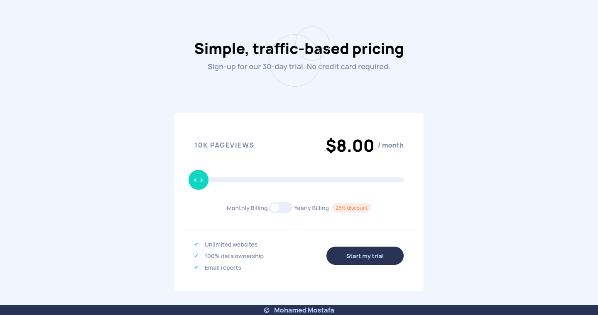

# What I Learned

- In this project I learned how to manage mouse events to achieve drag and drop effect, and how to make use of event delegation and target the element I am concerned with by e.target.closest method

```js
let target = e.target.closest(".draggable");
if (!target) return;
```

- How to take care of mouse click shift from the draggable element boundaries and margins

```js
 let shiftX = e.clientX - target.getBoundingClientRect().left;
      function moveAt(clientX) {
        let margins =
          parseInt(
            window
              .getComputedStyle(document.querySelector(".App > .container"))
              .getPropertyValue("margin-left")
          ) +
          (gridContainer.offsetWidth - viewBox.offsetWidth) / 2;
        let left = clientX - shiftX - margins - target.offsetWidth / 2;
        .
        .
        .
      }
```

- How to handle droppable elements using hidden property and document.elementFromPoint method

```js
function onMouseMove(e) {
  target.classList.add("dragging");
  fillRef.current.classList.add("dragging");
  target.classList.add("hidden");
  let elemBelow = document.elementFromPoint(
    e.clientX,
    sliderbar.getBoundingClientRect().top
  );
  target.classList.remove("hidden");
  moveAt(e.clientX);
  if (!elemBelow) return;
  let droppableBelow = elemBelow.closest(".droppable");
  if (currentDroppable != droppableBelow) {
    if (currentDroppable) {
      leaveDroppable(currentDroppable);
    }
    currentDroppable = droppableBelow;
    if (currentDroppable) {
      enterDroppable(currentDroppable);
    }
  }
}
```

- The difference between mouse and touch when handling dragging

```js
let target = e.targetTouches[0].target.closest(".draggable");
let shiftX = e.touches[0].clientX - target.getBoundingClientRect().left;
moveAt(e.touches[0].clientX);
let elemBelow = document.elementFromPoint(
  e.changedTouches[0].clientX,
  sliderbar.getBoundingClientRect().top
);
```

# Useful resources

- [javascript.info](https://javascript.info/event-details) - This helped me understanding how to manage mouse events and with dragging and dropping.

# Screenshots

## Desktop



## Mobile


